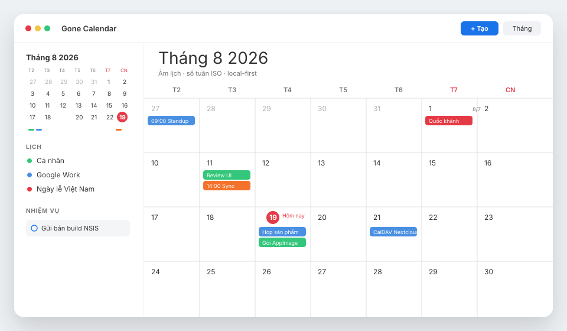
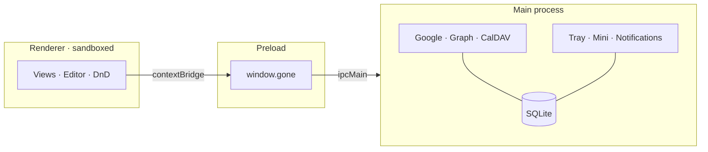

<p align="center">
  
</p>

<h1 align="center">Gone Calendar</h1>

<p align="center">
  <strong>Lịch desktop local-first cho Windows và Linux.</strong><br>
  Google, Microsoft 365 và CalDAV trong một cửa sổ — kèm <em>lịch âm</em> trên từng ngày.
</p>

<p align="center">
  
  
  
  
  
  
  
</p>

<p align="center">
  
</p>

<p align="center">
  <a href="#cài-đặt-nhanh">Cài đặt nhanh</a> ·
  <a href="#tính-năng">Tính năng</a> ·
  <a href="#kiến-trúc">Kiến trúc</a> ·
  <a href="#đóng-gói">Đóng gói</a> ·
  <a href="#tài-liệu">Tài liệu</a>
</p>

---

Một cửa sổ cho lịch cá nhân và lịch công việc. Dữ liệu nằm trên máy (SQLite). Sync khi có mạng. Không phụ thuộc GNOME, không phải bản fork One Calendar — và **có lịch âm Việt Nam**.

| Bạn đang dùng | Gone Calendar làm được |
| --- | --- |
| Google Calendar + Outlook + Nextcloud rải rác tab | Gom vào Day / Week / Month / Year / List |
| App lịch không có âm lịch | Nhãn âm lịch trên ô tháng, header tuần, list |
| Mất mạng là mất lịch | Xem và sửa offline, đẩy lên khi online |

---

## Tính năng

<table>
<tr>
<td width="50%" valign="top">

**Lịch**
- 5 view: Ngày, Tuần, Tháng, Năm, Danh sách
- Click ô trống → editor đầy đủ (không quick-add)
- Kéo thả sự kiện → Move / Copy / Hủy
- Lặp lại: lần này / từ đây trở đi / cả chuỗi
- Số tuần ISO, bật/tắt trong Settings

</td>
<td width="50%" valign="top">

**Việt Nam & ngôn ngữ**
- Lịch âm trên Month / Week / List
- Lịch ngày lễ Việt Nam (dương + âm)
- Lịch lễ quốc tế (subscribe 1 click)
- Giao diện tiếng Việt và English

</td>
</tr>
<tr>
<td width="50%" valign="top">

**Đồng bộ**
- Google Calendar (OAuth loopback PKCE)
- Microsoft 365 / Outlook.com (Graph)
- CalDAV: Nextcloud, Synology, generic
- Token trong OS secret store (`safeStorage`)
- Nhắc việc bằng thông báo Windows / Linux

</td>
<td width="50%" valign="top">

**Môi trường làm việc**
- Cửa sổ mini luôn-trên-cùng từ khay hệ thống
- Việc local: hạn, hoàn thành, hiện trên lịch
- Theme sáng / tối / theo hệ thống + wallpaper
- Tìm kiếm FTS5, phím tắt 1 phím (`T`, `1–5`, `N`, `/`)

</td>
</tr>
</table>

### Phím tắt

| Phím | Việc |
| --- | --- |
| `T` | Về hôm nay |
| `J` `→` / `K` `←` | Kỳ tiếp / kỳ trước |
| `1` `2` `3` `4` `5` | Ngày · Tuần · Tháng · Năm · List |
| `N` hoặc `C` | Tạo sự kiện |
| `Ctrl+K` hoặc `/` | Tìm kiếm |
| `?` | Bảng phím tắt |

---

## Cài đặt nhanh

Yêu cầu: **Node.js 20+**, Git.

```bash
git clone https://github.com/Deocomate/gone-calendar-electron.git
cd gone-calendar-electron
npm install
npm run dev
```

| Lệnh | Việc |
| --- | --- |
| `npm run dev` | Chạy app, hot-reload |
| `npm run typecheck` | Type-check main + renderer |
| `npm run test` | Vitest |
| `npm run build` | Bundle production |

OAuth Google / Microsoft và biến môi trường: [`docs/deployment-guide.md`](docs/deployment-guide.md). Sao chép [`.env.example`](.env.example) trước khi connect tài khoản.

---

## Kiến trúc



| Tầng | Thư mục | Việc |
| --- | --- | --- |
| Renderer | `src/renderer` | React, 5 view, editor, i18n, theme |
| Preload | `src/preload` | `window.gone` typed, sandbox bật |
| Main | `src/main` | SQLite, OAuth, sync, tray, thông báo |
| Shared | `src/shared` | `CalendarEvent`, `GoneAPI`, lịch âm, ngày lễ |

Nguyên tắc: **SQLite là nguồn sự thật cho UI**. Provider chỉ sync vào / ra. Lịch read-only (ngày lễ) không sửa từ editor.

---

## Đóng gói

```bash
npm run pack:win     # NSIS x64 — Windows 10/11
npm run pack:linux   # AppImage x64 — Ubuntu LTS và distro tương thích
```

Không đóng gói macOS. Không widget lock-screen, không in, không Exchange on-prem.

Chi tiết: [`docs/deployment-guide.md`](docs/deployment-guide.md).

---

## Tài liệu

| Tài liệu | Nội dung |
| --- | --- |
| [URD](docs/urd.md) | Yêu cầu người dùng, phạm vi, MoSCoW |
| [PDR](docs/project-overview-pdr.md) | Quyết định sản phẩm |
| [Architecture](docs/system-architecture.md) | Process, IPC, data flow |
| [Codebase](docs/codebase-summary.md) | Map thư mục và schema |
| [Design](docs/design-guidelines.md) | Token màu, chrome, motion |
| [Roadmap](docs/project-roadmap.md) | R1–R3 + Stretch đã xong |
| [Deploy](docs/deployment-guide.md) | Build, pack, OAuth |
| [Standards](docs/code-standards.md) | Naming, security |

---

## Giấy phép

[MIT](LICENSE) © Gone Calendar Team.

Phần mềm dùng `ical.js` (MPL-2.0) và `rrule` (BSD-3-Clause); các thư viện còn
lại là MIT hoặc ISC. Không có phụ thuộc copyleft lây lan.

---

<p align="center">
  <sub>Electron · React · TypeScript · Tailwind · SQLite · Windows & Linux</sub>
</p>
